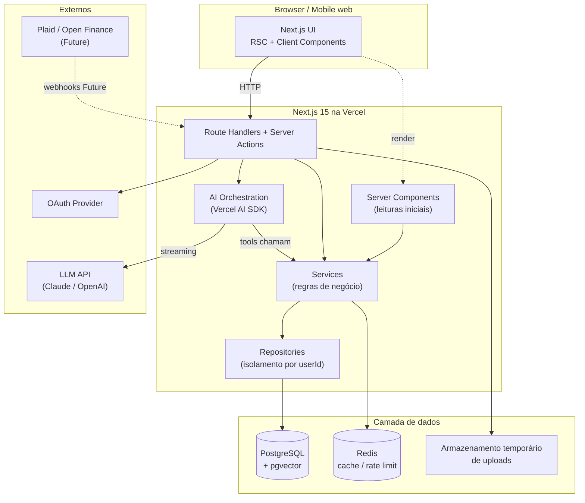
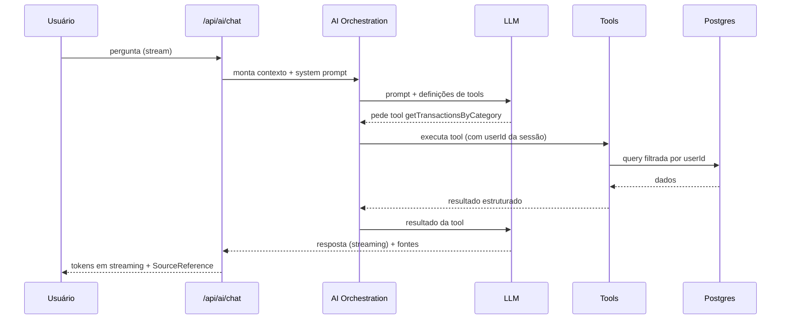
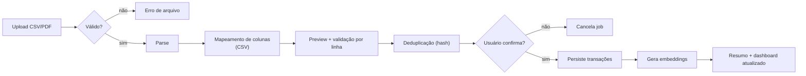

# FinSight AI — Technical Architecture

> Perspectiva: Tech Lead / Staff Engineer.
> Versão: 0.1 · Status: living document

---

## 1. Arquitetura técnica (visão geral)

FinSight AI é um monólito modular sobre Next.js 15 (App Router), deployado na Vercel, com Postgres + pgvector como fonte da verdade e Redis para cache/rate limit. A IA é orquestrada pelo Vercel AI SDK com tool calling sobre os dados do usuário. A separação é por **domínio** (features) no front e por **camadas** (route handler → service → repository) no back.

Princípios:

- **Server-first:** dados sensíveis e lógica ficam no servidor (RSC, route handlers, services). O cliente só recebe o que precisa renderizar.
- **Isolamento por usuário em toda query** — a camada de repositório sempre recebe e filtra por `userId`.
- **IA não acessa o banco diretamente** — só através de tools que já aplicam o isolamento por usuário.
- **Degradação graciosa:** falha de IA/Redis não derruba o core (transações continuam acessíveis).

Estratégias por tecnologia:

- **Server Components:** páginas, leituras iniciais (dashboard, listas) — buscam dados no servidor sem expor lógica.
- **Client Components:** interatividade (formulários, filtros, chat, gráficos).
- **React Query:** cache e sincronização de dados client-side que mudam por interação (filtros de transações, refetch após mutação).
- **Zustand:** estado de UI efêmero/global (painel de detalhe aberto, filtros ativos, draft do chat) — não para dados de servidor.
- **Route Handlers:** API REST por domínio (`/api/transactions`, `/api/import`, `/api/ai/chat`...).
- **Server Actions:** mutações simples acopladas a forms (criar transação, salvar meta) onde não há necessidade de endpoint público.
- **Drizzle:** schema tipado, migrations versionadas, queries no repository.
- **Redis:** cache de agregações do dashboard, rate limit de IA, dedupe de import.
- **pgvector:** embeddings de transações para RAG no chat.
- **Vercel AI SDK:** streaming + tool calling; prompts e tools versionados em `ai/`.
- **Upload:** via route handler com validação; armazenamento temporário; descarte pós-processo.
- **Testes:** Vitest (unit/integration) + Playwright (E2E) + Testing Library (componentes).
- **Local:** Docker Compose (Postgres+pgvector, Redis); seed script; `.env.example`.
- **Deploy:** Vercel (preview por PR, produção no merge em `main`); migrations no pipeline.

---

## 2. Estrutura de pastas recomendada

```txt
src/
  app/                      # rotas (App Router): páginas, layouts, route handlers
    (auth)/                 # grupo de rotas de auth/onboarding
    (app)/                  # grupo autenticado (dashboard, transactions, chat...)
    api/                    # route handlers por domínio
  components/
    ui/                     # primitivos shadcn (Button, Input, Dialog...)
    app/                    # layout/produto genérico (AppShell, PageHeader, MetricCard)
    charts/                 # wrappers de gráficos (Recharts/D3)
    feedback/               # EmptyState, LoadingState, ErrorState, Toast
  features/                 # código por domínio (UI + hooks + tipos locais)
    auth/  onboarding/  dashboard/  transactions/  imports/
    categories/  ai-chat/  insights/  reports/  goals/  debts/
    settings/  integrations/
  server/
    actions/                # Server Actions
    api/                    # helpers compartilhados de route handlers (responses, errors)
    services/               # regras de negócio (puras, testáveis)
    repositories/           # acesso a dados (Drizzle), sempre com userId
    validators/             # schemas Zod por domínio
  db/
    schema/                 # tabelas Drizzle
    migrations/             # migrations geradas
    seed/                   # seed de desenvolvimento
  ai/
    tools/                  # tools de leitura (getMonthlySummary...) + escrita controlada
    prompts/                # system prompts versionados
    rag/                    # recuperação de contexto
    embeddings/             # geração/armazenamento de embeddings
    guards/                 # sanitização, anti prompt-injection, limites
  lib/                      # utilitários (formatadores de moeda, datas, etc.)
  hooks/                    # hooks reutilizáveis
  styles/                   # globals, tokens
  types/                    # tipos compartilhados
  tests/                    # setup de testes, fixtures, mocks
docs/                       # esta documentação
```

Responsabilidades:

- `app/` — roteamento e composição; o mínimo de lógica.
- `features/` — tudo de um domínio junto (componentes, hooks, tipos), facilitando navegação.
- `server/services` — onde mora a regra de negócio (sem I/O direto, recebe repositórios).
- `server/repositories` — única camada que fala com o banco; impõe isolamento por usuário.
- `ai/` — orquestração de IA isolada, testável com mocks.
- `db/` — schema e migrations como fonte da verdade do modelo físico.

---

## 3. Estratégia de frontend

- **Server Components:** páginas e leituras iniciais (dashboard, lista de transações no primeiro load, relatórios). Sem `useState`/efeitos.
- **Client Components:** formulários, filtros, chat, gráficos interativos, painel de detalhe — marcados com `"use client"`.
- **React Query:** para dados que mudam por interação no cliente (paginação/filtro de transações, refetch pós-mutação, polling de status de import). Query keys por domínio + parâmetros.
- **Zustand:** estado de UI (qual transação está selecionada no master-detail, filtros ativos compartilhados, rascunho do chat). Nunca duplicar dados de servidor.
- **Hooks:** `features/x/hooks/useTransactions.ts` encapsula React Query; UI não chama fetch direto.
- **Formulários:** React Hook Form + Zod (mesmo schema do back via `validators/`).
- **Filtros:** estado em Zustand + sincronizado na URL (searchParams) para deep-link e SSR.
- **Tabelas:** TanStack Table dentro de `DataTable`; virtualização quando a lista crescer.
- **Loading/error/empty:** sempre via componentes dedicados de `feedback/`; toda query trata os 3 estados.
- **Layouts reutilizáveis:** `AppShell` no layout do grupo `(app)`.
- **Genérico vs produto:** primitivo em `components/ui`, layout em `components/app`, domínio em `features/*/components`.

---

## 4. Design system / UI foundation

| Componente                   | Onde                    | Tipo     | Props principais         | Estados                      | Testes           | Deps     |
| ---------------------------- | ----------------------- | -------- | ------------------------ | ---------------------------- | ---------------- | -------- |
| Button                       | `components/ui`         | genérico | variant, size, loading   | hover/focus/disabled/loading | unit             | cva      |
| Input                        | `components/ui`         | genérico | error, label             | focus/error/disabled         | unit             | —        |
| Select                       | `components/ui`         | genérico | options, value           | open/disabled                | unit             | radix    |
| Dialog                       | `components/ui`         | genérico | open, onOpenChange       | open/closed (focus trap)     | unit a11y        | radix    |
| Dropdown                     | `components/ui`         | genérico | items                    | open                         | —                | radix    |
| Card                         | `components/app`        | genérico | —                        | —                            | —                | —        |
| Table/DataTable              | `components/app`        | genérico | columns, data            | loading/empty                | unit             | tanstack |
| EmptyState                   | `components/feedback`   | genérico | title, action            | —                            | —                | —        |
| LoadingState                 | `components/feedback`   | genérico | variant (skeleton)       | —                            | —                | —        |
| ErrorState                   | `components/feedback`   | genérico | onRetry                  | —                            | —                | —        |
| ChartCard                    | `components/charts`     | genérico | title, data              | loading/empty                | —                | recharts |
| MetricCard                   | `components/app`        | produto  | label, value, trend      | —                            | unit             | —        |
| PageHeader                   | `components/app`        | produto  | title, subtitle, actions | —                            | —                | —        |
| Sidebar / Topbar             | `components/app`        | produto  | items, user              | active                       | —                | —        |
| DateRangePicker              | `components/app`        | genérico | range, onChange          | —                            | unit             | —        |
| FileUploader                 | `features/imports`      | produto  | accept, maxSize, onFiles | idle/uploading/error         | unit             | —        |
| TransactionForm              | `features/transactions` | produto  | initial, onSubmit        | submitting/error             | unit+integration | RHF+Zod  |
| CategoryBadge                | `features/categories`   | produto  | category                 | —                            | —                | —        |
| TransactionAmount            | `components/app`        | produto  | amount, currency         | —                            | unit             | —        |
| AIChatMessage                | `features/ai-chat`      | produto  | role, content, sources   | streaming                    | unit             | —        |
| InsightCard                  | `features/insights`     | produto  | insight, onAction        | —                            | unit             | —        |
| DebtCard / DebtStrategyPanel | `features/debts`        | produto  | debt / strategy          | —                            | unit             | —        |

---

## 5. Backend e API

- **Route Handlers:** um arquivo por recurso em `app/api/<domínio>/route.ts`; lógica delegada a services.
- **Validação:** todo input passa por schema Zod (`validators/`); rejeita cedo com 422.
- **Auth/autorização:** middleware extrai sessão; cada handler obtém `userId` e repassa aos services/repos. Nenhuma query sem `userId`.
- **Responses:** envelope consistente `{ data }` ou `{ error: { code, message, details? } }`.
- **Erros:** classe de erro de domínio mapeada para status HTTP; nunca vazar stack/PII.
- **Services/Repositories:** service = regra; repository = dados. Handlers ficam finos.
- **Sem lógica pesada na rota:** parsing/cálculo em services; rota só orquestra.

Endpoints iniciais:

```txt
POST   /api/auth/session            # via Auth.js
GET    /api/onboarding              # estado do onboarding
POST   /api/onboarding              # salva preferências
GET    /api/dashboard               # agregações do período
GET    /api/transactions            # lista (filtros, paginação)
POST   /api/transactions            # cria manual
PATCH  /api/transactions/:id        # edita / recategoriza
DELETE /api/transactions/:id        # soft delete
GET    /api/categories              # lista
POST   /api/categories              # cria
POST   /api/imports                 # cria job (upload)
GET    /api/imports/:id             # status / preview
POST   /api/imports/:id/confirm     # confirma persistência
POST   /api/ai/chat                 # streaming + tool calling
GET    /api/insights                # lista
POST   /api/insights/:id/action     # aplicar/ignorar/útil
GET    /api/reports                 # gera relatório
GET    /api/goals  POST /api/goals  PATCH/DELETE /api/goals/:id
GET    /api/debts  POST /api/debts  PATCH/DELETE /api/debts/:id
GET    /api/settings  PATCH /api/settings
POST   /api/settings/export         # exporta dados
DELETE /api/settings/account        # exclui conta
```

---

## 6. Banco de dados (Drizzle + PostgreSQL)

Estratégias transversais:

- **Multi-tenant por usuário:** toda tabela de domínio tem `user_id` (FK, indexado). Sem RLS no MVP, mas o repository impõe o filtro; `Decision Needed` — habilitar Postgres RLS na fase de hardening como defesa em profundidade.
- **Auditoria:** `audit_logs` append-only para ações sensíveis.
- **Soft delete:** `deleted_at` nas entidades de domínio; hard delete só na exclusão de conta.
- **Embeddings:** coluna `vector` (pgvector) em `ai_embeddings` com índice HNSW.
- **Importações:** `import_jobs` + `import_rows` preservam o bruto para auditoria/rollback.
- **IA:** `ai_conversations`/`ai_messages` guardam histórico; mensagens de tool registradas.

Tabelas (resumo de campos-chave):

```txt
users(id, email, oauth_provider, created_at)
user_profiles(user_id PK/FK, currency, primary_goal, closing_day, ai_consent_at)
accounts(id, user_id, name, type, institution, created_at, deleted_at)
categories(id, user_id, name, color, kind[income|expense], parent_id?)
transactions(id, user_id, account_id, category_id?, amount, currency, kind,
             description, occurred_at, origin[manual|import|recurring|integration],
             recurring_rule_id?, dedupe_hash, created_at, deleted_at)
tags(id, user_id, name)
transaction_tags(transaction_id, tag_id)            # PK composta
import_jobs(id, user_id, file_id, status, total_rows, error_count, created_at)
import_rows(id, job_id, raw, parsed, status, error?, dedupe_hash)
uploaded_files(id, user_id, kind[csv|pdf], size, checksum, created_at, purged_at?)
ai_conversations(id, user_id, title, created_at)
ai_messages(id, conversation_id, role[user|assistant|tool], content,
            tool_name?, tokens?, created_at)
ai_insights(id, user_id, type, severity[info|warning|risk], title, body,
            status[new|applied|dismissed|useful], created_at)
ai_embeddings(id, user_id, transaction_id?, content, embedding vector(1536), created_at)
financial_goals(id, user_id, name, target_amount, current_amount, due_date?,
                status[active|completed|late], created_at, deleted_at)
debts(id, user_id, name, institution, principal, balance, monthly_rate,
      installment_amount, remaining_installments, created_at, deleted_at)
integration_connections(id, user_id, provider, status, access_token_enc,
                        refresh_token_enc, created_at)            # Future
webhook_events(id, connection_id, type, payload, processed_at?)  # Future
audit_logs(id, user_id, action, target, metadata, created_at)    # append-only
notification_preferences(user_id PK/FK, spend_alerts, installment_reminders,
                         weekly_summary, anomaly_alerts)
```

Índices/constraints principais: `transactions(user_id, occurred_at)`, `transactions(dedupe_hash)` único por conta, `ai_embeddings` HNSW em `embedding`, FKs com `on delete cascade` no fluxo de exclusão de conta.

---

## 7. IA e RAG

- **Embeddings:** ao importar/criar transação, gerar embedding de uma representação textual ("2026-05-31 · Mercado Extra · Alimentação · -312"), armazenar em `ai_embeddings` com `user_id`.
- **Armazenamento:** pgvector, índice HNSW, busca por similaridade filtrada por `user_id`.
- **Recuperação de contexto (RAG):** para perguntas semânticas ("aquela compra grande no shopping"), recuperar top-k transações relevantes do próprio usuário e injetar no contexto.
- **Tool calling:** o modelo decide quais tools chamar; tools fazem queries estruturadas (mais confiáveis que RAG para números). RAG complementa, tools dominam.
- **Tools (leitura):** `getMonthlySummary`, `getTransactionsByCategory`, `getSpendingTrends`, `getRecurringExpenses`, `getBudgetRisks`, `getGoalProgress`, `getIncomeVsExpense`, `getTopMerchants`, `getUnusualSpending`, `getAvailableReports`, `getDebtOverview`.
- **Tools (escrita controlada):** `createInsight`, `categorizeTransaction` — exigem confirmação do usuário antes de efetivar.
- **Proteção de dados:** toda tool recebe `userId` do contexto de sessão (nunca do prompt) e filtra por ele. O modelo nunca recebe credenciais nem acessa o banco diretamente.
- **Respostas seguras:** system prompt instrui tom não-julgador, disclaimers, e proíbe inventar números (só reportar o que as tools retornam).
- **Custo:** rate limit por usuário; cache de respostas a perguntas idênticas no período; Haiku para tarefas baratas (categorização), modelo maior para chat. `Risk`
- **Streaming:** via Vercel AI SDK (`streamText`/`streamUI`).
- **Registro:** conversas e mensagens em `ai_*`; tokens contabilizados para métrica de custo.
- **Testes de tools:** unitários com banco de teste/fixtures; testes do chat com modelo mockado.
- **Prompt injection:** `ai/guards` sanitiza conteúdo vindo de dados do usuário (descrições, PDFs); instruções e dados são claramente separados; tools têm escopo restrito e jamais executam ações destrutivas sem confirmação. `Risk`
- **Escopo da IA:** limitado às finanças do próprio usuário; recusa pedidos fora de escopo.
- **System prompts:** versionados em `ai/prompts`, testáveis e revisáveis.

---

## 8. PDF/CSV ingestion

- **Upload:** route handler recebe arquivo; valida tipo (csv/pdf) e tamanho (limite, ex. 10MB).
- **CSV:** parsing com biblioteca robusta; mapeamento de colunas pelo usuário (data, valor, descrição); normalização de formatos (decimal, data).
- **PDF (`Should Have`):** extração de texto + heurísticas/IA por layout de banco; qualidade varia → preview obrigatório. `Risk`
- **Preview:** `ImportPreviewTable` com validação por linha; linhas inválidas sinalizadas sem bloquear as válidas.
- **Deduplicação:** `dedupe_hash` = hash(data+valor+descrição+conta); duplicatas marcadas e não inseridas.
- **Confirmação:** persistência só após o usuário confirmar; transação de banco para atomicidade.
- **Persistência:** insere transações + gera embeddings (async/queue quando crescer).
- **Erro/rollback:** falha no meio → job marcado como falho, sem transações órfãs.
- **Segurança:** sem PII em logs; arquivo descartado (`purged_at`) após processamento conforme política.
- **Logs/testes:** job auditável; testes com fixtures de CSV de vários bancos.

---

## 9. Segurança e privacidade

- **Autenticação:** Auth.js (OAuth + JWT), sessões seguras (httpOnly, sameSite).
- **Autorização:** `userId` da sessão em toda operação; sem confiar em IDs vindos do cliente.
- **Isolamento:** repository filtra por `userId`; `Decision Needed` Postgres RLS no hardening.
- **Rate limit:** Redis (por usuário/IP) em endpoints sensíveis e IA.
- **Criptografia:** tokens de integração cifrados em repouso (`Future`); TLS em trânsito (Vercel).
- **Validação/sanitização:** Zod em toda entrada; sanitização de conteúdo para IA.
- **Logs:** estruturados, sem dados financeiros/PII.
- **Prompt injection / ingestão:** guards dedicados; limites de arquivo; escopo de tools.
- **Permissões:** verificação de propriedade do recurso em cada acesso.
- **LGPD/GDPR:** consentimento explícito; exportar dados; excluir conta (hard delete); auditoria.
- **Session security:** rotação/expiração; CSRF para mutações via form quando aplicável.

---

## 10. Observabilidade

- **Sentry:** erros de front e back, releases vinculadas ao deploy.
- **OpenTelemetry:** tracing distribuído (request → service → repo → db / IA).
- **Logs estruturados:** JSON, com `requestId`/`userId` (hash), sem PII.
- **Métricas de API:** latência, taxa de erro por endpoint.
- **Métricas de IA:** tokens, custo por usuário, latência, taxa de feedback negativo.
- **Tracing:** spans para tool calls e parsing de import.
- **Import/webhooks:** contadores de erro por linha; falhas de webhook (`Future`).
- **Alertas:** erro acima de threshold, custo de IA acima do orçamento, falha de migration.

---

## 11. Testes

Ordem do que testar primeiro: regras de negócio dos services (mais valor, menos custo), depois endpoints e fluxos críticos, depois E2E dos caminhos principais.

- **Vitest (unit):** services (cálculo de dashboard, dedupe, estratégia de dívida), validators, formatadores.
- **Vitest (integration):** route handlers + repositories contra banco de teste.
- **Testing Library:** componentes do design system e formulários.
- **Playwright (E2E):** onboarding → criar transação → ver dashboard; importar CSV → confirmar; perguntar à IA (com modelo mockado).
- **Testes de API:** contratos de resposta e erros.
- **Regras de negócio:** isolamento por usuário (tentar acessar dado de outro → negado).
- **Upload:** fixtures de CSV válidos/ inválidos; PDFs de exemplo.
- **IA:** tools com fixtures; chat com modelo mockado (sem custo/flakiness).
- **A11y:** axe nos componentes e páginas-chave.

---

## 12. CI/CD (GitHub Actions)

```yaml
jobs:
  ci:
    steps:
      - checkout
      - setup-node (cache npm)
      - install (npm install --frozen-lockfile)
      - verify-envs (checa variáveis obrigatórias)
      - lint (eslint)
      - typecheck (tsc --noEmit)
      - unit (vitest run)
      - drizzle-check (migrations consistentes com schema)
      - build (next build)
      - e2e (playwright, em serviço com Postgres+Redis)
      - deploy-preview (Vercel, em PR)
      - sentry-release (em main)
```

- Cache de dependências e do build.
- Deploy preview por PR; produção no merge em `main`.
- Migrations aplicadas no pipeline de deploy.

---

## 13. Documentação open source

Arquivos:

- `README.md` — pitch, screenshots, stack, setup, status do roadmap.
- `CONTRIBUTING.md` — como rodar, padrões, fluxo de PR.
- `CODE_OF_CONDUCT.md` — Contributor Covenant.
- `SECURITY.md` — como reportar vulnerabilidade.
- `LICENSE` — `Decision Needed` (MIT recomendado para portfólio).
- `.env.example` — todas as variáveis.
- `docs/product.md`, `docs/design-system.md`, `docs/architecture.md` (este), `docs/api.md`, `docs/database.md`, `docs/ai.md`, `docs/roadmap.md`, `docs/testing.md`, `docs/observability.md`.

---

## Apêndice A — Diagrama de arquitetura (alto nível)



## Apêndice B — Fluxo de uma pergunta ao chat (sequência)



## Apêndice C — Fluxo de ingestão de extrato


